# Web Scraping et Analyse de Données

Ce projet vise à récupérer des articles à partir du site web de la BBC, les stocker dans une base de données MySQL, puis effectuer une analyse rapide des données récupérées.

## Instructions pour Lancer le Code

1. Clonez ce repository.
2. Installez les dépendances Python en exécutant la commande suivante :

    pip install -r requirements.txt

3. Exécutez le code Python dans un environnement compatible. Par exemple, si vous utilisez Jupyter Notebook, lancez-le en exécutant :

   jupyter notebook

## Étape 1 : Récupération d'un Article

- **Site Web**: BBC (https://www.bbc.com)
- **Outil de Scraping**: BeautifulSoup (bs4)
- **Code Python**:

Résultat 1:
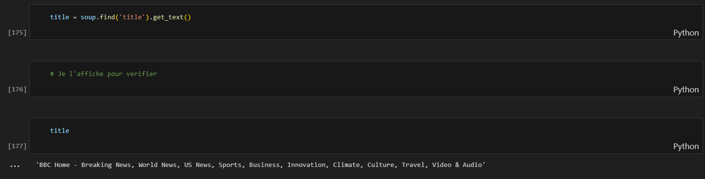

Résultat 2 :

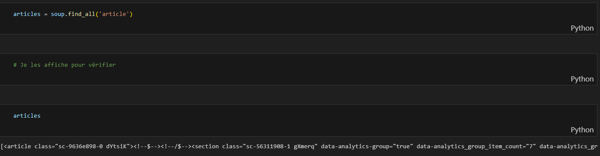

Résultat 3 :
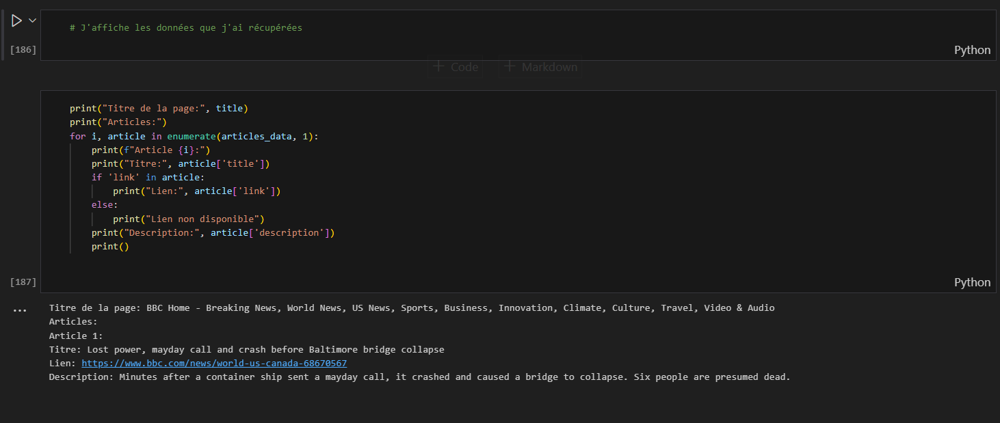

## Étape 2 : Récupération de plusieurs Articles

- **Site Web**: BBC (https://www.bbc.com)
- **Outil de Scraping**: BeautifulSoup (bs4)
- **Code Python**:

Import important :

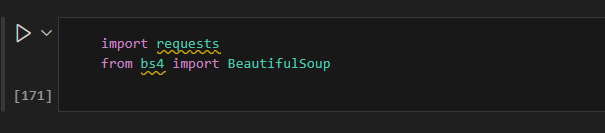

Résultat 1:

Résultat 2 :
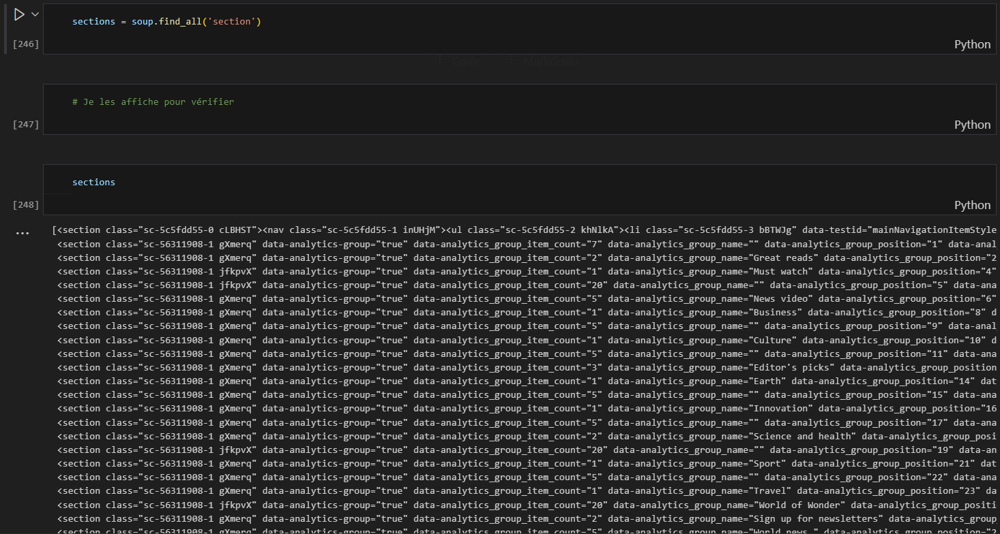

Résultat 3 :

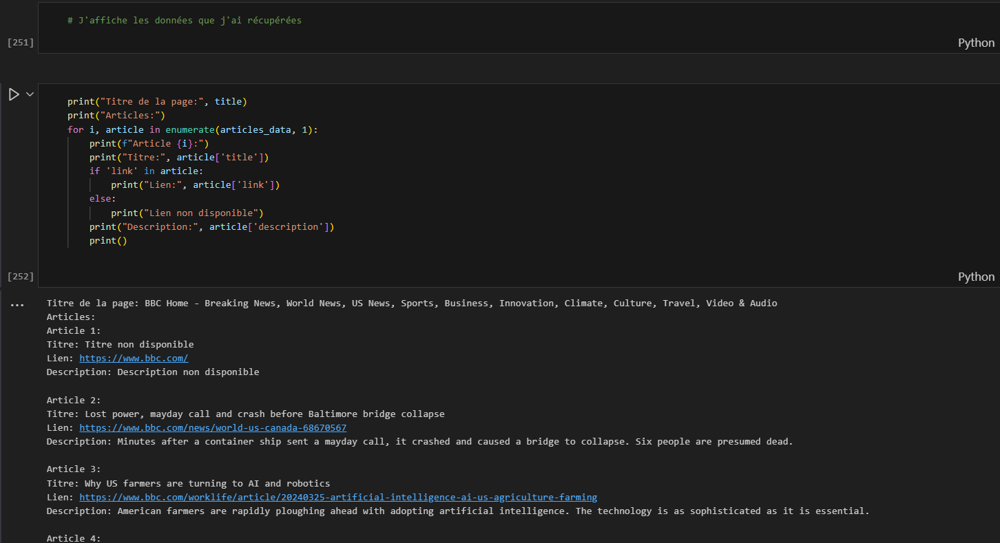

## Étape 3 : Enregistrement des Données dans la Base de Données

- **Technologie de Base de Données**: MySQL
- **Code Python**:

Import important: 

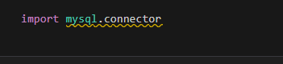

Connexion à la base de données :

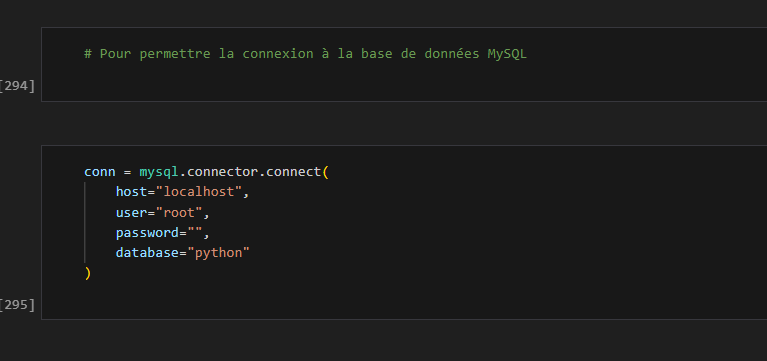

Création de la table Articles :

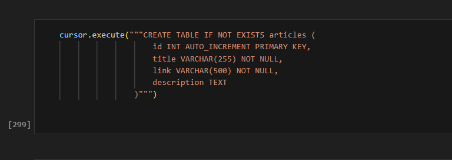

- **Résultat**:
  - Les données ont été enregistrées dans la table 'articles' de la base de données.

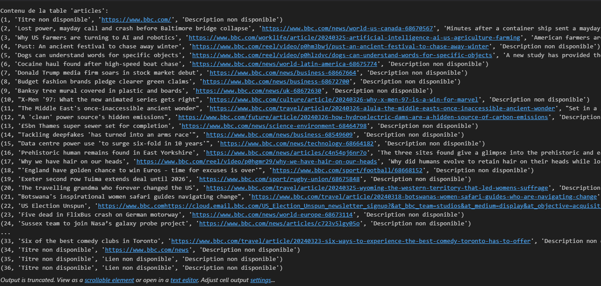

## Étape 4 : Analyse Rapide des Données Récupérées

- **Résultat**:
- Nombre d'articles avec description : 8
- Nombre d'articles sans description : 28
- Nombre total d'articles: 36
- Nombre d'articles avec lien : 34
- Nombre d'articles sans lien : 2

## Étape 5 : Docker

- **Prérequis**:

- Docker
- Docker Compose

- **Étapes**:

- Assurez-vous que Docker est installé sur votre machine.
- Placez-vous à la racine du projet.
- Construisez l'image Docker en exécutant la commande suivante :

  docker-compose build

  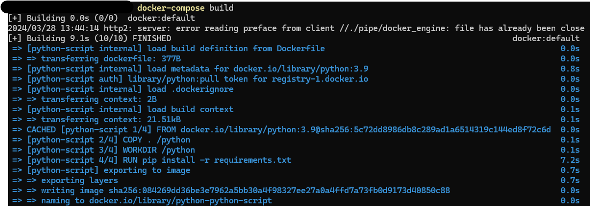

- Exécutez le conteneur Docker en exécutant la commande suivante :

 docker-compose up

- **Remarque**:

Assurez-vous d'ajuster les chemins et les noms de fichiers dans le Dockerfile et le docker-compose.yml selon votre structure de répertoire et le nom de votre script.